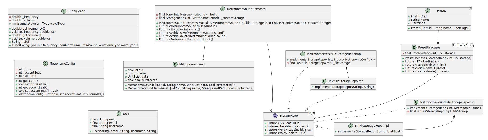

# Classes

## 1 The Class Diagram of the Domain Model




## 2 Glossary

| Class Name                             | Description                                                                 |
|----------------------------------------|-----------------------------------------------------------------------------|
| **User**                               | Represents an application user with unique identification                   |
| **MetronomeSound**                     | Audio sample used for metronome clicks, can be built-in or user-created     |
| **MetronomeConfig**                    | Settings for metronome operation (tempo, accent beat, click sound)          |
| **TunerConfig**                        | Settings for audio tuning functionality (frequency, volume, waveform type)  |
| **Preset\<T\>**                        | Generic class for storing presets of any type                               |
| **StorageRepo\<ID, T\>**               | Generic interface for data persistence operations (CRUD)                    |
| **TextFileStorageRepoImpl**            | Concrete implementation for storing text data in files                      |
| **BinFileStorageRepoImpl**             | Concrete implementation for storing binary data in files                    |
| **MetronomePresetFileStorageRepoImpl** | Specialized repository for metronome presets using file storage             |
| **MetronomeSoundFileStorageRepoImpl**  | Specialized repository for metronome sounds using file storage              |
| **PresetUsecases\<T\>**                | Business logic layer for managing configuration presets                     |
| **MetronomeSoundUsecases**             | Business logic layer for managing metronome sounds with built-in fallbacks  |


## 3 Pseudo-Dart-Code of the Planned Classes

```dart

/************** 
 ** Entities **
 **************/

class User {
    User(this.uuid, {required this.email, required this.username});

    final String uuid;
    final String email;
    final String username;
}

class MetronomeSound {
    MetronomeSound({this.id, required this.name, required this.data, this.isProtected = false});
    MetronomeSound.fromAsset({this.id, required this.name, String assetPath, this.isProtected = true});

    final int? id;
    String name;
    Uint8List data;
    final bool isProtected; // protected means can't be changed by the User through the UI
}

class MetronomeConfig {
    MetronomeConfig({this.bpm = 120, this.accentBeat = 4, this.soundId})

    int _bpm;
    int get bpm => _bpm;
    set bpm(int val) => /* assume validate and set logic */;

    int _accentBeat;
    int get accentBeat => _accentBeat;
    set accentBeat(int val) => /* assume validate and set logic */;

    int? soundId; // if invalid or null just use the default sound (and show <missing> in the ui)
}

class TunerConfig {
    TunerConfig({this.frequency = 440.0, this.volume = 0.5, this.waveType = minisound.WaveformType.sine})

    double _frequency;
    double get frequency => _frequency;
    set frequency(double val) => /* assume validate and set logic */;

    double _volume;
    double get volume => _volume;
    set volume(double val) => /* assume validate and set logic */;

    minisound.WaveformType waveType;

    String note(); // returns the note for the selected frequency; like this to indicate a calculation is happening
}

class Preset<T> {
    Preset({this.id, required this.name, required this.settings});

    final int? id;
    String name;
    T settings;
}


/*********** 
 ** Repos **
 ***********/

interface StorageRepo<ID, T> {
    Future<T?> load(ID id);
    Future<Iterable<ID>> list();
    Future<void> save(ID id, T val);
    Future<void> delete(ID id);
}

class TextFileStorageRepoImpl implements StorageRepo<String, String> { /* implementation */ }

class BinFileStorageRepoImpl implements StorageRepo<String, Uint8List> { /* implementation */ }

// this is not a usecase, but a repository that rely on another repository for separation of concerns (this one serializes the object, and file-related stores it into the file)
class MetronomePresetFileStorageRepoImpl implements StorageRepo<int, Preset<MetronomeConfig>> {
    /* implementation */

    final TextFileStorageRepoImpl _fileStorage;
}

// this is not a usecase, but a repository that rely on another repository for separation of concerns (this one serializes the object, and file-related stores it into the file)
class MetronomeSoundFileStorageRepoImpl implements StorageRepo<int, MetronomeSound> {
    /* implementation */

    final BinFileStorageRepoImpl _fileStorage;
}


/************** 
 ** Usecases **
 **************/

class PresetUsecases<T extends Preset> {
    PresetUsecases(StorageRepo<int, T> storage);

    Future<T?> load(int id);
    Future<Iterable<int>> list(); 
    Future<void> save(T preset);
    Future<void> delete(T preset);

    final StorageRepo<int, T> _storage;
}

class MetronomeSoundUsecases {
    MetronomeSoundUsecases(Map<int, MetronomeSound> builtin, StorageRepo<int, MetronomeSound> customStorage);

    Future<MetronomeSound?> load(int id);
    Future<Iterable<int>> list();
    Future<void> save(MetronomeSound sound);
    Future<void> delete(MetronomeSound sound);

    Future<MetronomeSound> fallback(); // when the `soundName` is invalid or null, this is used instead of loading

    final Map<int, MetronomeSound> _builtin;
    final StorageRepo<int, MetronomeSound> _customStorage;
}
```
