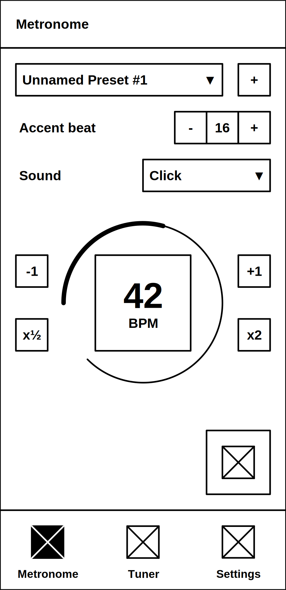
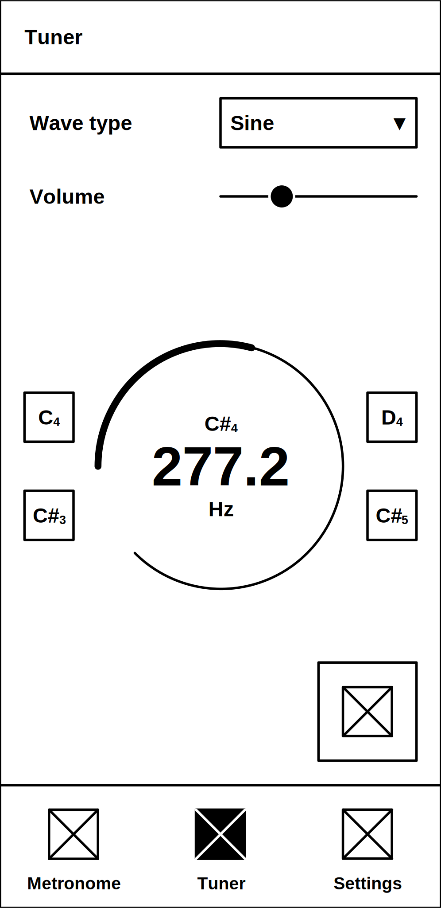
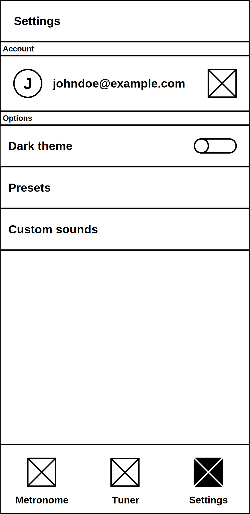
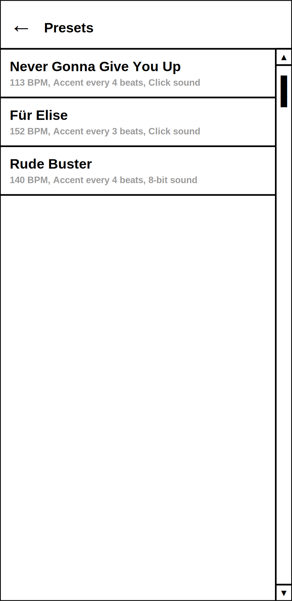
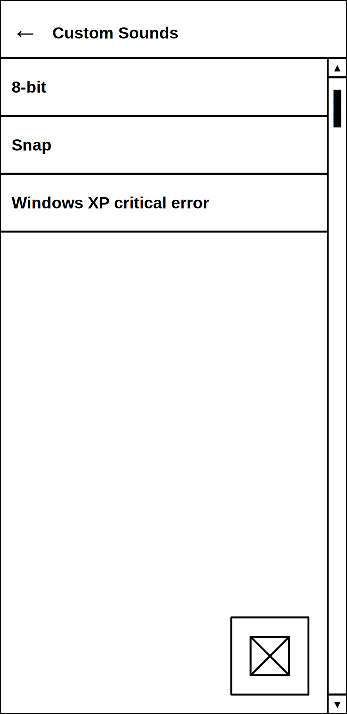

# Requirements Document

## 1 INTRODUCTION

This document provides an overview of the requirements for the TempTune mobile app. TempTune is a metronome and tuner application designed to help in musical practice. This document serves as a definitive guide for the development team and will be used for verification and QA upon its completion.

### 1.1 Buisness Requirements

Musicians of all skill levels require precise tools for rhythm and pitch during practice. Many existing solutions are separate apps or physical devices, creating a fragmented experience. Users need to switch between apps or carry physical gear, disrupting their focus and flow state.

There is a clear opportunity for a unified, high-quality application that combines an advanced metronome with an accurate tuner. TempTune will provide a seamless, all-in-one practice toolkit within a single, intuitive and modern UI. By offering unique features like flexible preset configuration, the application will cater to the modern musician's need for efficiency and collaboration, creating a superior user experience that drives adoption and retention.

The TempTune application will provide users with a core metronome functionality, a tone generator for instrument tuning, and the ability to create, save and manage custom presets. Another goal is to implement synchronization of these presets  as well as custom sounds across user deivces. The initial release will not include social features and a comprehensive account system beyond what is required for sync functionality.

### 1.2 Competitive Analysis

Several established apps exist in this space, but they typically excel in one core area - either as a metronome *or* a tuner - but rarely offer a deeply integrated and equally powerful experience for both. TempTune will differentiate itself by providing an integrated toolkit, with a focus on customizable sounds and seamless preset management across devices, which is rerely found in current market offerings.

## 2 USER REQUIREMENTS

This section describes the external interfaces, user profiles, and overarching constraints of the TempTune application.

### 2.1 Software Interfaces

The application will interact with the following external systems and libraries:

- Flutter, the core framework for cross-platform development.

- Minisound, the primary audio engine for playing pre-recorded metronome sounds and generating waves for the tuner. This dependency is critical for achieving low-latency audio playback.

- A cloud storage service (Firebase, AWS Amplify, or a custom backend). A service to facilitate the synchronization of user presets across multiple devices. This will handle user authentication, data storage and real-time updates.

### 2.2 User Interfaces

The user interface shall consist of three main screens, navigable via a bottom navigation bar or a main drawer menu:

#### 2.2.1 Metronome screen. 

This is the primary screen featuring a preset selector, a BPM dial/slider, time signature selector, tap tempo button and start/stop controls. Visual feedback will be prominently displayed on the each beat.

#### 2.2.2 Tuner screen.

This is the second screen dedicated to the tone generator. It will feature a frequency selector, a volume control and start/stop controls.

#### 2.2.3 Settings screen.

This screen hosts account and application settings (e.g. theme), and a button to navigate to the metronome presets and loaded sounds screen.

Additinal screens that are navigatable only from on other screens:

#### 2.2.4 Presets screen.

This is a screen for managing metronome presets (view, edit, delete).

#### 2.2.5 Custom sounds screen.

This is a screen for managing loaded sounds (load in, view, edit, delete).

The overall UI shall adhere to modern Material Design 3 guidelines, ensuring a native feel on the mobile platform. The design will prioritize clarity, large touch targets, and minimalism to avoid distracting the user during practice or performance.

### 2.3 User Characteristics

Intended users are musicians of all skill levels, across various instruments (guitar, piano, violin, drums, etc.). Users are assumed to have basic familiarity with standard musical terms such as BPM, time signatures and note names. The app must be intuitive enough for a beginner to use effectively without instruction and users are not required to have advanced technical expertise.

### 2.4 Assumptions and Dependencies

The successful implementation of the stated requirements depends on the following factors:

- The app will be unable to synchronize metronome presets without an internet connection and a granted OS permission for the network access.

- The app will be unable to load custom sounds without a granted OS permission for the storage access.

## 3 SYSTEM REQUIREMENTS

This section details the specific, actionable requirements for the TempTune application.

### 3.1 Functional Requirements

#### 3.1.1 Metronome Functionality

- The system shall allow the user to adjust the tempo using a visual slider or dial within a range of 30 to 250 BPM.

- The system shall provide a "Tap Tempo" feature, allowing the user to set the BPM by tapping the button in rhythm.

- The system shall allow the user to select a beat the accent will be applied, as well as disabling accent completely.

<!-- - The system shall provide real-time visual feedback (e.g. a flashing indicator or animated pendulum) synchronized with the beat. -->

- The system shall prevent the device it is running from locking the screen.

#### 3.1.2 Tuner Functionality

- The system shall display the currently selected frequency and its corresponding note.

- The system shall generate a pure, stable wave tone at a user-selected frequency, corresponding to musical notes from A0 to C8.

- The system shall allow the user to adjust the volume of a generated tone independently of the system volume.

- The system shall allow the user to select the waveform type (sine, square, triangle, sawtooth) for a generated tuning tone.

#### 3.1.3 Preset Management

- The system shall allow the user to save the current metronome configuration as a named preset.

- The system shall allow the user to select the current metronome configuration from the list of saved presets.

- The system shall provide a place for the user to view, edit and delete saved presets.

<!-- share presets? -->

#### 3.1.4 Sound Customization

- The system shall provide a set of built-in, high-quality sounds for the metronome clicks (e.g. wood block, beep, click).

- The system shall allow the user to import custom sound files from device storage to use as metronome clicks.

- The system shall provide a screen for the user to view, edit and delete loaded sounds.

#### 3.1.5 Synchronization

- The system shall allow the user to create an account and authenticate with a service.

- The system shall synchronize the user's saved presets and loaded sounds across all their devices upon authentication.

### 3.2 Non-Functional Requirements

- Reliability: the metronome must not drop beats, stutter, or crash during use, especially during long practice sessions. The application shall undergo stress testing with no audio glitches or application failures. It must reliably maintain audio focus and handle interruptions (e.g. incoming calls) gracefully.

- Performance: audio latency must be minimized to ensure the timing of the metronome click is perceived as instantaneous. The audio output latency shall be consistently below 50ms on supported mid-range and high-end devices. The UI must render at a consistent 60fps to ensure smooth visual feedback.

- Usability: the application must be intuitive for a musician to use immediately, often in a high-pressure practice or performance setting. A new user shall be able to start the metronome and adjust the BPM within 10 seconds of opening the app. 

## 4 APPENDIX

### 4.1 References 

- [Flutter Docs](https://flutter.dev/docs).

- [Minisound API Reference](https://pub.dev/documentation/minisound/latest/).

- [Material Design Guidelines](https://m3.material.io/).
