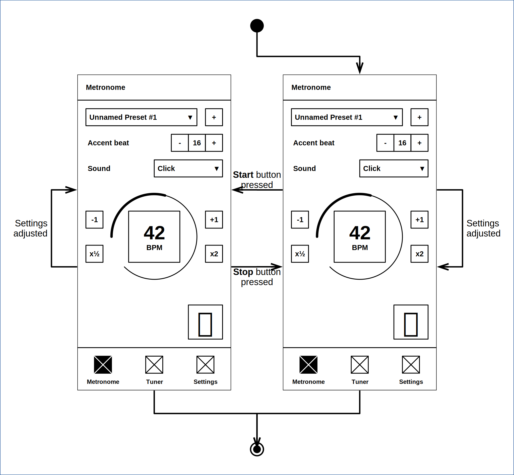
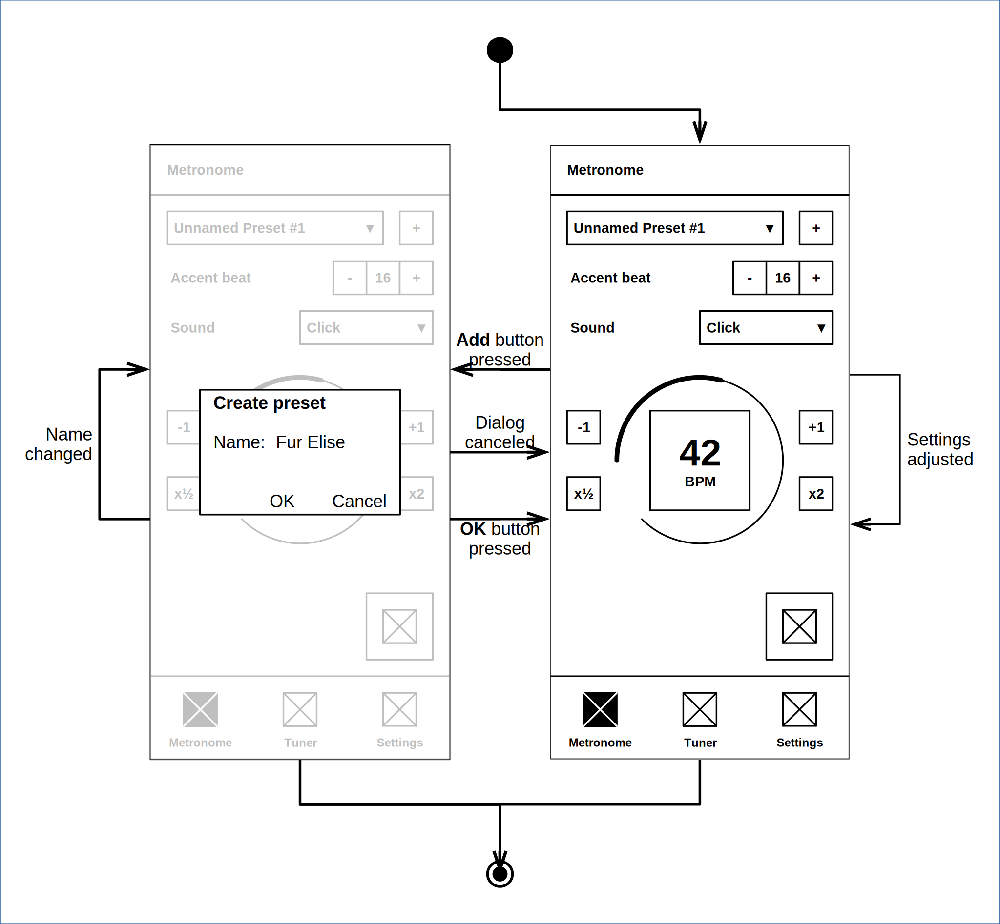
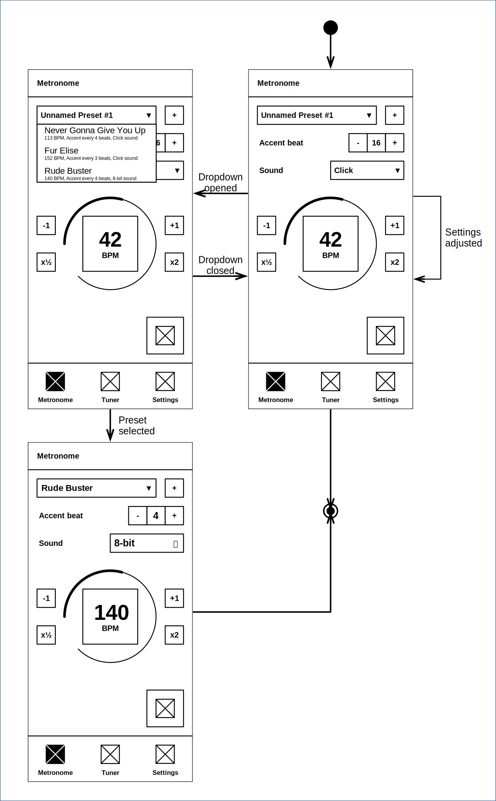
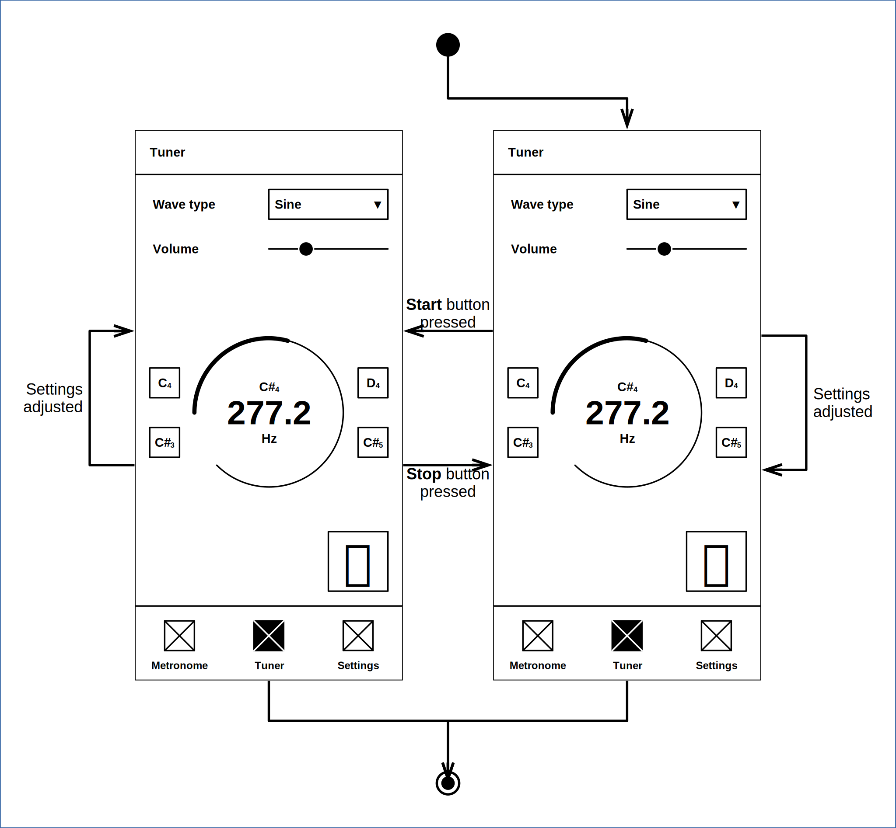

# States

## 1 The State Diagrams for the Core Use Cases

### 1.1 Use Metronome for Musical Practice

### 1.2 Create and Save a Metronome Preset

### 1.3 Load a Metronome Preset

### 1.4 Tune Instrument

