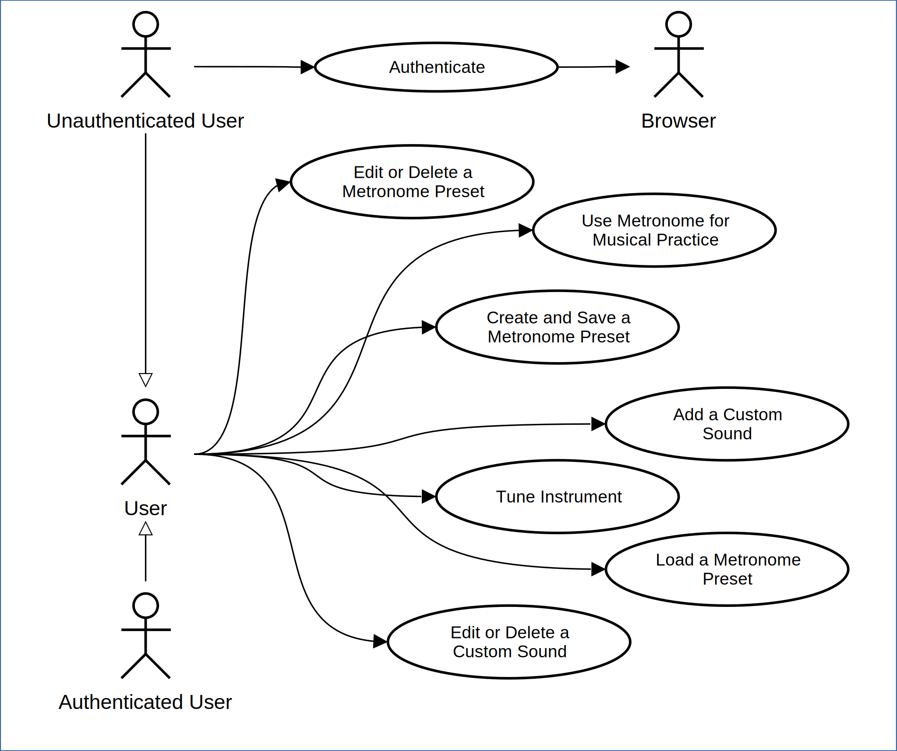

# Use Cases

## 1 Actors

| Actor                |                                                                    |
|----------------------|--------------------------------------------------------------------|
| User                 | A person using the application. Presumably, a musician.            |
| Authenticated User   | A user that used the **Login with Google** option to authenticate. |
| Unauthenticated User | A user that didn't use a **Login with Google** option.             |
| Browser              | The application on the User's OS used to brouse the Internet.      |

## 2 Usage Variants

### 2.1 Use Metronome for Musical Practice

**Actor:** User

**Preconditions:** App is installed and opened on the **Metronome** screen.

**Main Flow:**
1. User adjusts the BPM using the slider to their desired tempo.
1. User selects the desired click sound.
1. User adjusts the accent beat value.
1. User presses the **Start** button.
1. System produces a consistent auditory click at the specified tempo.
1. User practices ther instrument along with the metronome.
1. User presses the **Stop** button when finished.

**Alternate Flows:**

- A1: Use Tap Tempo:
    1. User taps **Tap Tempo** button repeatedly to set the BPM.
    1. System calculates and sets the BPM based on tap intervals.
    1. The flow continues from the step 3 of the main flow.

### 2.2 Create and Save a Metronome Preset

**Actor:** User

**Preconditions:** App is installed and opened on the **Metronome** screen.

**Main Flow:**
1. User configures the metronome with specific BPM, click sound and accent beat value.
1. User presses the **Add Preset** button.
1. System displays a dialog for naming the preset.
1. User enters a name and confirms.
1. System saves the current configuration as a named preset.

**Alternate Flows:**

- A1: Cancel Preset Creation:
    1. After step 3, user cancels the dialog.
    1. System returns to the metronome screen without saving.

**Postconditions:** The preset is available for the selection and listed on the **Presets** screen.

### 2.3 Load a Metronome Preset

**Actor:** User

**Preconditions:** App is installed and opened on the **Metronome** screen. At least one preset has been saved.

**Main Flow:**
1. User selects a preset in the dropdown.
1. System applies all saved settings (BPM, sound, accent beat).

**Postconditions:** The metronome is configured with the settings loaded from the preset.

### 2.4 Tune Instrument

**Actor:** User

**Preconditions:** App is installed and opened on the **Tuner** screen.

**Main Flow:**
1. User adjusts the frequency using the slider to their desired note.
1. User selects the desired wave type.
1. User adjusts the volume to a desired level.
1. User presses the **Start** button.
1. System generates a continuous sine wave at the selected frequency.
1. User plays the corresponding node on their instrument and adjusts its pitch to match the generated tone.
1. User presses the **Stop** button when finished tuning.

### 2.5 Authenticate

**Actor:** User

**Preconditions:** App is installed and opened on the **Settings** screen. User has account credentials or wants to create an account.

**Main Flow:**
1. User selects the **Login with Google** option.
1. System opens login with google page in the Browser.
1. User selects their Google account and grants permissions.
1. System receives authentication conformation and the user profile.
1. System enables synchronization features and displays uer as logged in.

**Alternate Flows:**

- A1: Authentication Canceled:
    1. After step 2 user cancels the Google authentication process.
    1. System returns to the **Settings** screen without authentication.

### 2.6 Edit or Delete a Metronome Preset

**Actor:** User

**Preconditions:** App is installed and user is on **Settings** screen. At least one preset exists.

**Main Flow:**
1. User presses the **Metronome Presets** button.
1. System navigates to the **Metronome Presets** screen where a list of saved presets is displayed.
1. User presses on a preset.
1. System displays a dialog, with the preset configutaion and **Delete** option.
1. User changes the preset configuration and confirms.
1. System saves updated preset.

**Alternate Flows:**

- A1: Cancel:
    1. After step 4 user cancels the edit.
    1. System discards changes and returns to the preset list.

- A2: Delete Metronome Preset:
    1. After step 4 user selects **Delete** option.
    1. System removes the selected preset.

**Postconditions:** Preset is updated or removed based on user action.

### 2.7 Add a Custom Sound

**Actor:** User

**Preconditions:** App is installed and user is on **Settings** screen.

**Main Flow:**
1. User presses the **Custom Sounds** button.
1. System navigates to the **Custom Sounds** screen where a list of custom sounds is displayed.
1. User presses the **Add** button.
1. System displays a dialog, with the custom sound configutaion.
1. User adjusts the custom sound configuration and confirms.
1. System saves a new custom sound.

**Alternate Flows:**

- A1: Cancel:
    1. After step 4 user cancels the dialog.
    1. System discards changes and returns to the custom sound list.

**Postconditions:** A new custom sound is added.

### 2.8 Edit or Delete a Custom Sound

**Actor:** User

**Preconditions:** App is installed and user is on **Settings** screen.

**Main Flow:**
1. User presses the **Custom Sounds** button.
1. System navigates to the **Custom Sounds** screen where a list of custom sounds is displayed.
1. User presses on a custom sound.
1. System displays a dialog, with the custom sound configutaion and **Delete** option.
1. User changes the custom sound configuration and confirms.
1. System saves updated custom sound.

**Alternate Flows:**

- A1: Cancel:
    1. After step 4 user cancels the edit.
    1. System discards changes and returns to the custom sound list.

- A2: Delete Custom Sound:
    1. After step 4 user selects **Delete** option.
    1. System removes the selected custom sound.

**Postconditions:** Custom sound is updated or removed based on user action.
